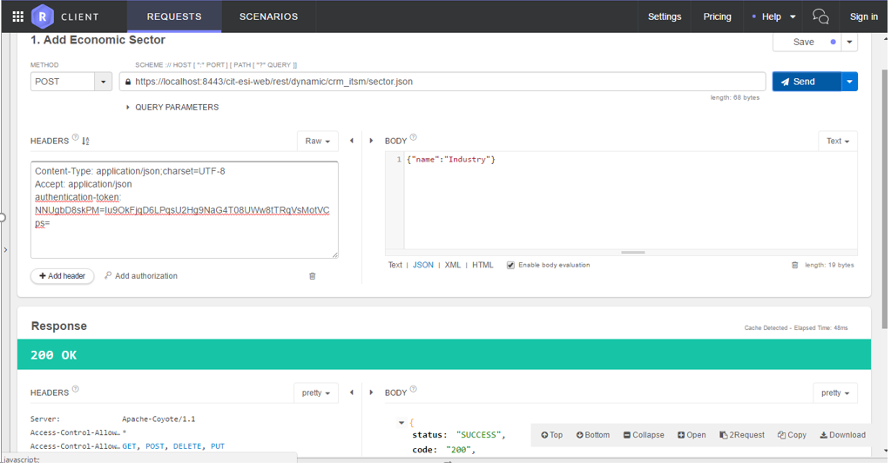
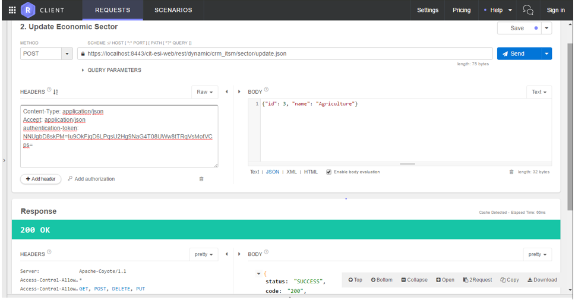
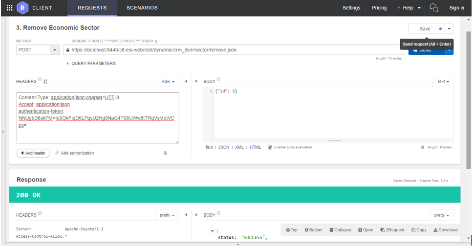
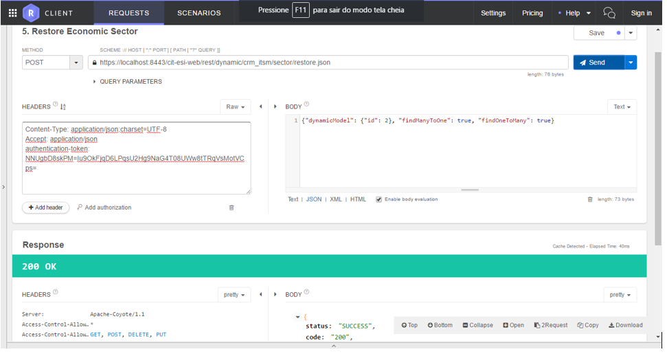
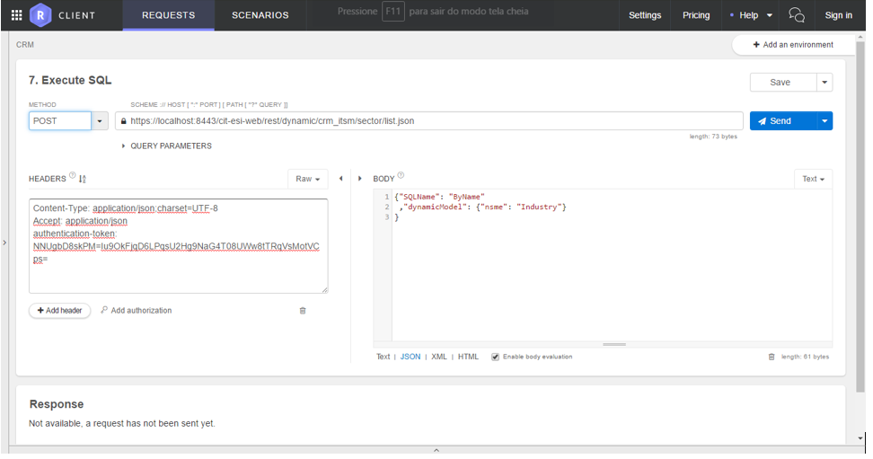
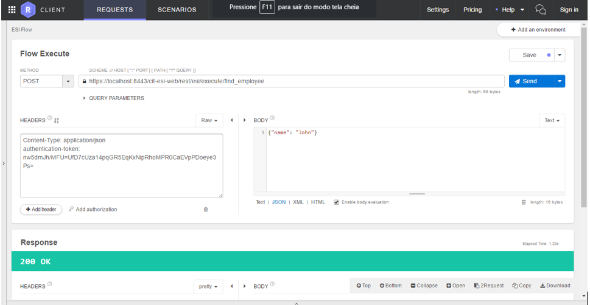

Title: Webservices - NEURO
Description: NEURO Webservices

#Webservices NEURO

This document gathers the minimum knowledge necessary for the adequate use of
the services via Rest.

| **URL**                                      | **Description**                           | **Parameters**                                | **Return**                                        |
|----------------------------------------------|-------------------------------------------|-----------------------------------------------|---------------------------------------------------|
| **/startWithMap/{name}**                     | Starts an ESI flow by name                | name: Name of the registered flow             | Representation of the registered flow object      |
| **/instance/initialize/{processInstanceId}** | Retrieve the values of a process instance | processInstanceid: ID of the process instance | Representation of the registered process instance |
| **/instance/suspend/{processInstanceId}**    | Suspends a process instance               | processInstanceid: ID of the process instance | Representation of the registered process instance |
| **/instance/restart/{processInstanceId}**    | Restarts a process instance               | processInstanceid: ID of the process instance | Representation of the registered process instance |
| **/instance/reopen/{processInstanceId}**     | Reopens a process instance                | processInstanceid: ID of the process instance | Representation of the registered process instance |
| **/userTask/{userTaskId}**                   | Retrieves an user task                    | userTaskId: ID of the created user task       | Representation of the registered process instance |
| **/rule/executeWithMap/{name}**              | Executes a business rule                  | name: Name of the registered business rule    | Representation of the executed business rule      |

-   request body: JSON Object with the variables for the flow
-   request body:JSON Object with the variables for the business rule

**Table 1 - Specification of APPLICATION PROGRAMMABLE INTERFACES** **(API)**

SPECIFIC GUIDELINES FOR REST API ACCESS
---------------------------------------

In the following sections, each type of intended use for the services available via Rest is detailed in the CITSMart Enteprise Neuro product.

###Authentication

To use the APIs, the client must be logged into Neuro. To do this, simply get a token from the authentication service and inject that token into the header of each REST request with the authentication-token identifier.
Authentication is done through the POST **/cit-esi-web/rest/security/token** service, passing a JSON object with the username and password attributes in the body.

**Figure 1 - Example using the Chrome Restart Client plugin**

###Business Objects REST API

Each business object provides a set of REST services that can be consumed from the URL **/cit-esi-web/dynamic/{application name}/{business object name}**. These are basic services for creating, updating, listing and deleting the business object, as well as a getStructure method that returns the metadata of the business object. Each SQL created in the business object can also be called in method form.
Following are examples using the hotel business object of the hotels application. For each request, the authentication-token obtained in the login service must be provided. The url should end with ".json".

####Inclusion of business object

-   **HTTP verb**: POST
-   **URL:** /cit-esi-web/rest/dynamic/{application name}/{business object name}.json
-   **Body:** JSON containing the attributes of the business object record to be included

**Figure 2 - Inclusion of business object**

####Business Object Change

-   **HTTP verb**: POST
-   **URL:** /cit-esi-web/rest/dynamic/{application name}/{business object name} /update.json
-   **Body:** JSON containing the attributes of the business object record to be changed

**Figure 3 - Change of business object**

####Business Object Deletion

-   **HTTP verb: **POST
-   **URL:** /cit-esi-web/rest/dynamic/{application name}/{business object name}/remove.json
-   **Body: **JSON containing the primary key of the business object record to be deleted

**Figure 4 - Business Object Deletion**

####Listing of business objects

-   **HTTP verb:** GET
-   **URL:** /cit-esi-web/rest/dynamic/{application name}/{business object name}.json

**Figure 5 - Listing of business objects**

#### Business object recovery by primary key

-   **HTTP verb: **POST
-   **URL:** /cit-esi-web/rest/dynamic/{application name}/{business object name}/restore.json
-   **Body:** JSON containing:
    -   The primary key of the business object record to be deleted
    -   Attribute boolean findManyToOne, indicating whether the system should retrieve many relationships for one of the object
    -   Boolean findOneToMany attribute, indicating whether the system should retrieve one-to-many relationships from the object

**Figure 6 - Recovery of business object by primary key**

#### Retrieving the structure of the business object

-   **HTTP verb: **GET
-   **URL:** /cit-esi-web/rest/dynamic/{application name}/{business object name}/getStructure.json

**Figure 7 - Recovery of the structure of the business object**

#### SQL Execution of the Business Object

-   **HTTP verb**: POST
-   **URL:** / cit-esi-web / rest / dynamic / {application name} / {business object name} /list.son
-   **Body:** JSON containing:
    -   SQLName attribute with the name of the SQL to be executed
    -   JSON dynamicModel attribute containing the expected parameter values in SQL
    -   Attribute boolean findManyToOne (optional), indicating whether the system should retrieve many relationships for one of the object
    -   Attribute boolean findOneToMany (optional), indicating whether the system should retrieve one-to-many relationships from the object

**Figure 8 - SQL execution of the business object**

### Execution of ESI streams

Any ESI stream can be executed via REST using the POST service **/cit-esi-web/rest/esi/execute/{stream name}**. For each request, the authentication-token obtained in the login service must be provided.
In the body of the request a JSON containing the input variables required to execute the flow must be provided.
The example below performs the job-search flow, providing the "12345" enrollment as the input variable of the stream.
The stream returns the "employee" JSON object.

**Figure 9 - Example of running ESI streams**

<b>Produto/Versão:</b> CITSmart ESP | 8.00 &nbsp; &nbsp;
<b>Atualização:</b>12/12/2018 - Andre Luiz de Oliveira Fernandes
	

